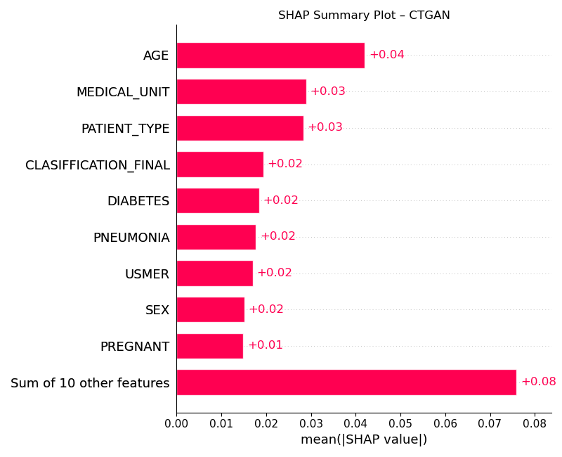
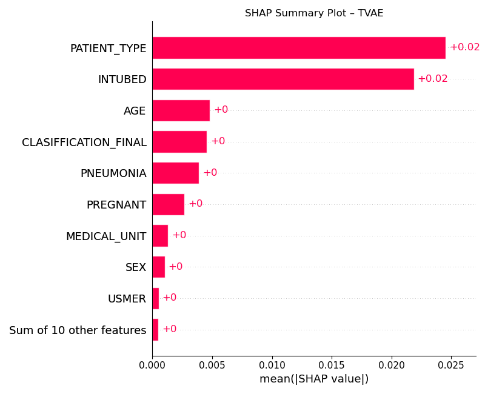
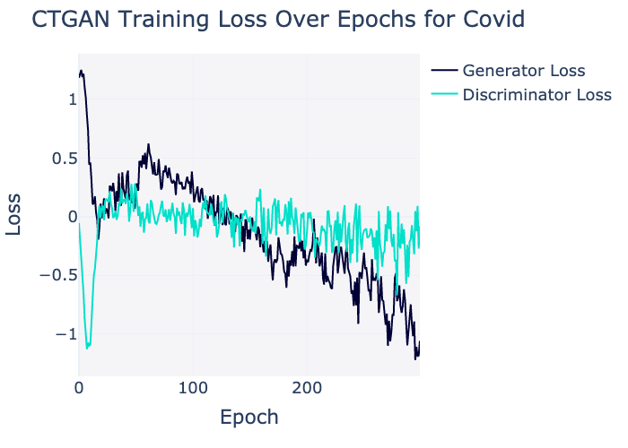
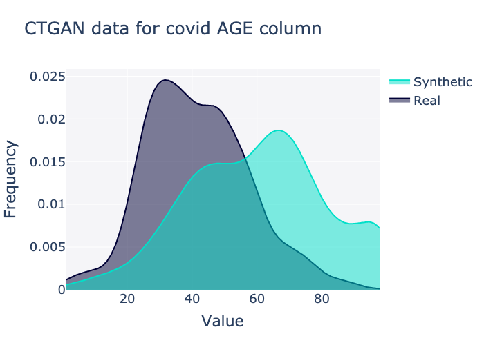
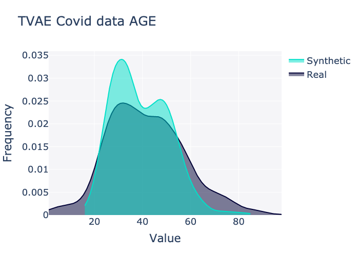
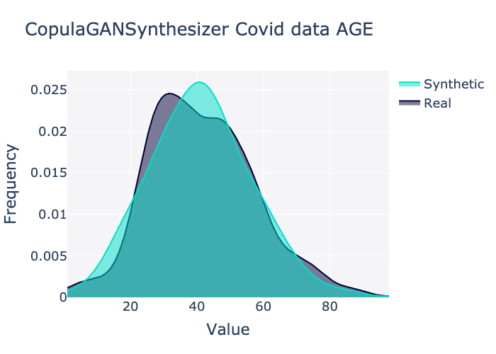
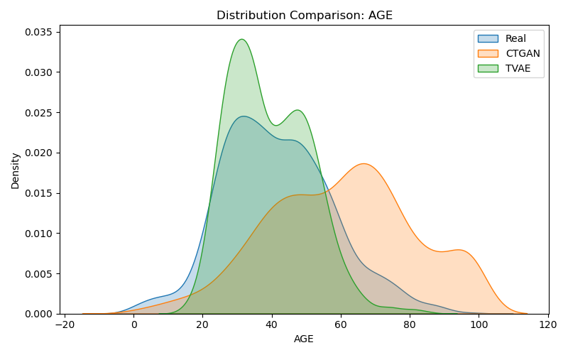
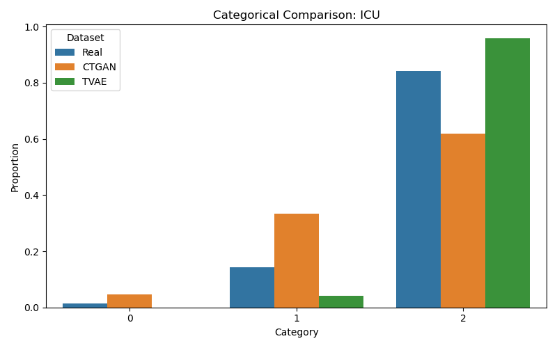
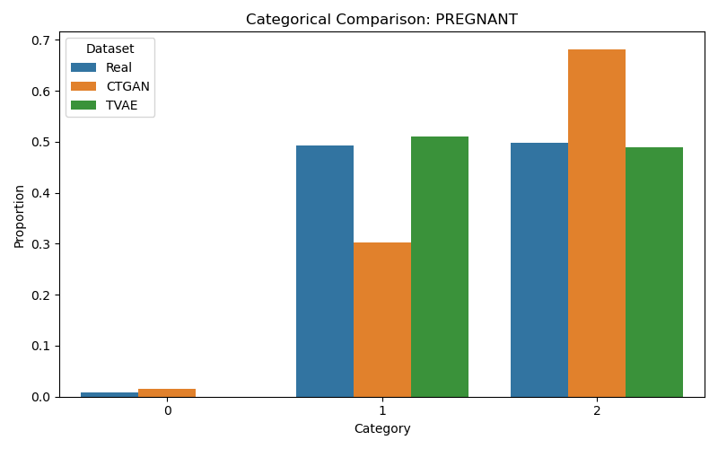

# Synthetic Data Generation for COVID-19 & Cardiovascular Data using CTGAN & TVAE

## Overview

This project applies deep generative models — **CTGAN**, **TVAE**, and **CopulaGAN** — from the SDV library to generate high-fidelity synthetic datasets for healthcare analytics. The main goals include:

- Preserving patient privacy  
- Enabling model training without exposing sensitive real data  
- Analyzing prediction consistency using SHAP  

### Public datasets used:

- **COVID-19** dataset from Mexican government (via [Kaggle](https://www.kaggle.com/datasets/meirnizri/covid19-dataset))  
- **UCI Heart Disease** dataset

---

## Objectives

- Handle missing/inconsistent medical data (97/98/99 → NaN)  
- Generate synthetic data using:  
  - CTGAN (Conditional Tabular GAN)  
  - TVAE (Tabular Variational Autoencoder)  
  - GaussianCopula (baseline comparison for AGE)  
- Evaluate data quality and realism via:  
  - **KDE plots** (numerical comparison)  
  - **Bar plots** (categorical comparison)  
  - **SHAP** interpretability  
  - **Random Forest** prediction tests  

---

## Datasets

### COVID-19 Dataset

- ~1M records; sampled 1000 for efficient experimentation  
- Comorbidities: COPD, Diabetes, Hypertension, etc.  
- Target: ICU admission

**Preprocessing**:
- Replaced 97, 98, 99 with NaN  
- Imputed numerical NaNs using median  
- Clipped AGE between 1–100  
- Label encoding applied for model input  

### UCI Heart Disease Dataset

- Attributes: Cholesterol, Age, Blood Pressure, etc.  
- Target: Heart disease classification  

---

## Methodology

### Preprocessing

- Uniform NaN handling across datasets  
- Label encoding for model input and SHAP compatibility  
- Separate pipelines for COVID and Cardio datasets  

### Synthetic Data Generation

- **CTGAN**: Trained for 50+ epochs with batch size 1000  
- **TVAE**: Trained separately and compared with CTGAN  
- **CopulaGAN**: Used for baseline distribution alignment (AGE column)  

---

## Evaluation Techniques

- **Statistical Summaries**: mean, std, min, max  
- **KDE Plots**: AGE comparisons (Real vs CTGAN vs TVAE vs CopulaGAN)  
- **Bar Plots**: ICU and PREGNANT categorical columns  
- **SHAP Interpretability**:  
  - Random Forest models trained on synthetic datasets  
  - CTGAN SHAP → AGE, DIABETES, INTUBED among top factors  
  - TVAE SHAP → INTUBED dominant; DIABETES underweighted  

---

## Key Observations

- **CTGAN** produced more balanced SHAP contributions across clinical factors  
- **TVAE** emphasized INTUBED but downplayed AGE and DIABETES  
- **AGE** distribution closer to real data with **TVAE**, but **CTGAN** preserved overall diversity better  
- **CopulaGAN** aligned reasonably with the real distribution for AGE  

---

## Visual Output Examples


| Plot Type                      | Thumbnail Preview |
|-------------------------------|-------------------|
| SHAP (CTGAN)                  | [](results/shap_ctgan.png) |
| SHAP (TVAE)                   | [](results/shap_tvae.png) |
| CTGAN Loss                    | [](results/loss_ctgan.png) |
| KDE AGE (CTGAN only)          | [](results/ctgan_age_covid.png) |
| KDE AGE (TVAE only)           | [](results/tvae_age_covid.png) |
| KDE AGE (CopulaGAN)           | [](results/copula_age_covid.png) |
| KDE AGE (All Models)          | [](results/AGE_distribution_comparison.png) |
| ICU Comparison                | [](results/ICU_categorical_comparison.png) |
| PREGNANT Comparison           | [](results/PREGNANT_categorical_comparison.png) |


---


## File Structure

```
Repo1/
├── datasets/
│   ├── Covid_Data.csv
│   └── heart_disease_dataset.csv
├── ctgan_tvae_covid_cardio.py
├── results/
│   ├── shap_ctgan.png
│   ├── shap_tvae.png
│   ├── loss_ctgan.png
│   ├── loss_tvae.png
│   └── *.png
├── Covid_Synthetic_Data_CTGAN.csv
├── Covid_Synthetic_Data_TVAE.csv
├── Heart_Synthetic_Data_CTGAN.csv
├── Heart_Synthetic_Data_TVAE.csv
├── README.md
├── requirements.txt
└── .gitignore
```

---

## Tools Used

- **Python** (Pandas, NumPy)  
- **SDV** (CTGAN, TVAE, GaussianCopula)  
- **SHAP**, **LIME** (exploratory)  
- **Plotly**, **Matplotlib**, **Seaborn**  
- **Scikit-learn** (Random Forest)  

---

## Authors

- **Sheshank Priyadarshi**  
- **Parth Chopra**  

---

## License

MIT